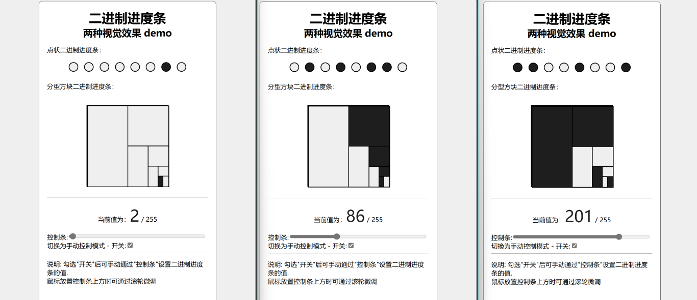

# binary_progress_bar
A progress bar demo with "binary" display.



### Usage

#### In GitHub page

[binary_progress_bar](https://ngc13009.github.io/binary_progress_bar/)

#### By self

You can start a local server directly in Python

```bash
$ python -m http.server 80
```

Then open in your browser. [http://127.0.0.1:80/](http://127.0.0.1:80/)

### TODO

1. Organize the code and provide a copy of the English comments.
2. and an English version of the webpage.

